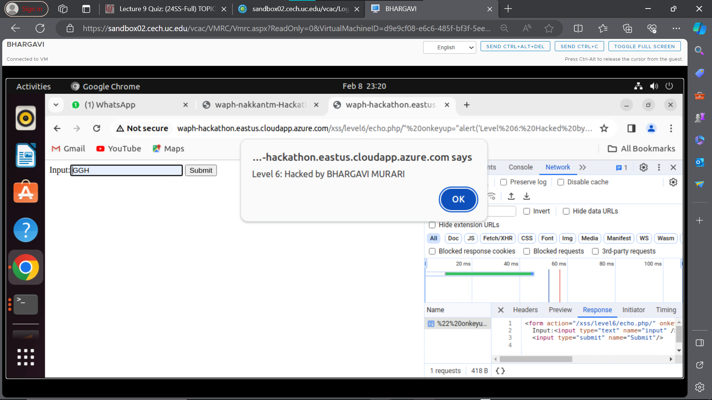

# WAPH-Web Application Programming and Hacking

## Instructor: Dr. Phu Phung

## Student

**Name**: Bhargavi Murari

**Email**: muraribi@mail.uc.edu


## Repository Information
Repository's URL: [https://github.com/BhargaviMurari22/waph-muraribi.git](https://github.com/BhargaviMurari22/waph-muraribi.git)

## Hackathon 1 Report:
## Overview and outcomes:
The "Cross-site Scripting Attacks and Defenses" hackathon offers participants a thorough exploration of online application security, placing special emphasis on addressing the pervasive threat of cross-site scripting (XSS) attacks. Through hands-on lab exercises, attendees gain firsthand experience in understanding the risks associated with XSS vulnerabilities. These vulnerabilities pose serious threats to user data, session cookies, and the overall system integrity of web applications, allowing the injection and execution of scripts on legitimate web pages. The hackathon aims to empower participants with the knowledge and skills necessary to both exploit and defend against XSS vulnerabilities. The primary focus is on implementing robust defense strategies to significantly mitigate these risks. Using the attached GitHub link, access the lab materials: https://github.com/BhargaviMurari22/waph-muraribi/tree/main/labs/hackathon1

## Task 1:
### LEVEL 0:

URL used: 
(http://waph-hackathon.eastus.cloudapp.azure.com/xss/level0/echo.php)

Script used for attacking:
```<script>alert("Level0: Hacked by BHARGAVI MURARI")</script>```


### LEVEL 1:

URLused: 

(http://waph-hackathon.eastus.cloudapp.azure.com/xss/level1/echo.php)

Script was written at the end of the URL as a path variable. 

The attacking script used was given below,

 ```?input=<script>alert("Level 1: Hacked by BHARGAVI MURARI")</script>```

 


### LEVEL 2:

URLused: 

(http://waph-hackathon.eastus.cloudapp.azure.com/xss/level2/echo.php)
This HTTP request has been converted into a basic HTML form as it does not include an input field and does not allow a path variable. The employment of a hacking script is then made easier by the attacking script being guided through this form.

```<script>alert("Level2 Hacked by BHARGAVI MURARI")</script>```

Source Code Guess:
```
if(!isset($_POST['input'])){
 die("{\"error\": \"Please provide 'input' field in an HTTP POST Request\"}");
 } else {
 echo $_POST['input'];
 }
```


### LEVEL 3:

URLused:

(http://waph-hackathon.eastus.cloudapp.azure.com/xss/level3/echo.php)
This degree of security prevents the script tag from being directly entered into the input variable. To take use of this URL, the code was broken up into several pieces and connected to cause a warning to appear on the website.

Script tag used for attacking:

```?input=<script<script>>alert("Level 3 Hacked by BHARGAVI MURARI")</scrip</script>t>```
 
 Source code guess: Script tag may be substituted with a blank,
 ```str_replace(['<script>', '</script>'], '', $input)```
 


### LEVEL 4:

URLused: 

(http://waph-hackathon.eastus.cloudapp.azure.com/xss/level4/echo.php)
At this point, the script tag is fully filtered, thus it won't be able to be blocked even if the string is broken up and then joined together. Using the onerror() method of the tag to inject the XSS script allowed me to set off an alarm.

Script tag used:

```?input=```

Code injected:

```
?input=<button onclick="alert('Level4')"></button>
Source code guess:
$data = $_GET['input'];
if (preg_match('/<script\b[^>]*>(.*?)<\/script>/is', $data)) {
exit('{"error": "No \'script\' is allowed!"}');
} else {
echo $data;
}
```


### LEVEL 5:

URLused: 

(http://waph-hackathon.eastus.cloudapp.azure.com/xss/level5/echo.php)
Both the slert function and the tag are filtered at this level. 
I combined the button tag’s onerror function with unicode encoding 
to raise the popup alert.


Code injected:

```
?input=
```

Source Code Guess:

```
$data = $_GET['input'];
 if (preg_match('/<script\b[^>]*>(.*?)<\/script>/is', $data) || stripos($data, 'alert') !== false) {
 exit('{"error": "No \'script\' is allowed!"}');
 } else {
 echo $data;
 }
 ```


### LEVEL 6:

URLused: 

(http://waph-hackathon.eastus.cloudapp.azure.com/xss/level6/echo.php)

This level still takes input even though I think the original 
code uses the htmlentities method to translate necessary characters
into their correct HTML entities. As a result, the webpage shows
user input as plain text. In certain situations, JavaScript 
eventListeners like onmouseover, onclick, onkeyup, and onmouseenter
can be used to initiate an alert. In this case, every time a key 
is hit in the input field, the onmouseenter eventListener that 
I used triggers an alarm on the website. 
The input form element 
is altered when the script is inserted through the URL, 
as shown in the illustration below. 
It appends to the code.


 ```
<form action="/xss/level6/echo.php/" onkeyup="alert('Level 6 : Hacked by BHARGAVI MURARI')" method="POST">
 Input:<input type="text" name="input" />
 <input type="submit" name="Submit"/></form>
 ```

Source Code Guess:

```
echo htmlentities($_REQUEST('input'));
```





## Task 2.

A. By adding code for input validation and editing the echo.php file, Lab 1's defensive measures against XSS were put into place. After a preliminary check to make sure the input is empty, PHP is stopped from running. When the input is verified as genuine, the htmlentities technique is used to clean it up. It then gets converted into the appropriate HTML characters so that it shows up on the page as text only.

echo.php defence
 ```
<?php
if(!isset($_REQUEST["data"])){ die("{\"error\": \"Please provide 'data' field\"}");
}
echo htmlentities($_REQUEST['data']);
?>
```


B. Once external input points were identified, the waph-muraribi.html code underwent a significant change. After each of these inputs was verified, the result texts were edited.
i) There is now validation applied to the input data for the HTTP GET and POST request forms. The request cannot be handled until the user input has been validated thanks to the introduction of a new function called validateInput.


ii) InnerText was substituted for innerHTML in cases when the display was plain text and HTML rendering was not required.


 iii) To improve security by cleaning replies, a newly added function named encodeInput has been developed. To prevent cross-site scripting attacks, this entails transforming special characters into the proper HTML entities before adding them to the HTML content. As a result, the material is not executable and is handled as text only. InnerText is the material that is injected into a newly generated div element by the code. It is then given back as HTML content.
 
```
 function encodeInput(input){
 const encodedData = document.createElement('div');
 encodedData.innerText=input;
 return encodedData.innerHTML;
 }
```


iv) Updates have been made to the joke retrieval API to guarantee the accuracy of the results that are received. New validations have been added, which verify that jokes in JSON are not empty. An error notice appears when the result is null.


 v) It is confirmed that the asynchronous method guessAge’s received result
 is either empty or non-zero. In addition, the data entered by the user is
 checked to make sure it is not null or empty. An error notification appears
 on each of these occasions.
 
```
if(result.age==null || result.age==0)
return $("#response")
.text("An error occured at this moment, So age cant be displayed");
$("#response").text("Hello "+name+" ,your age should be "+result.age);
```


