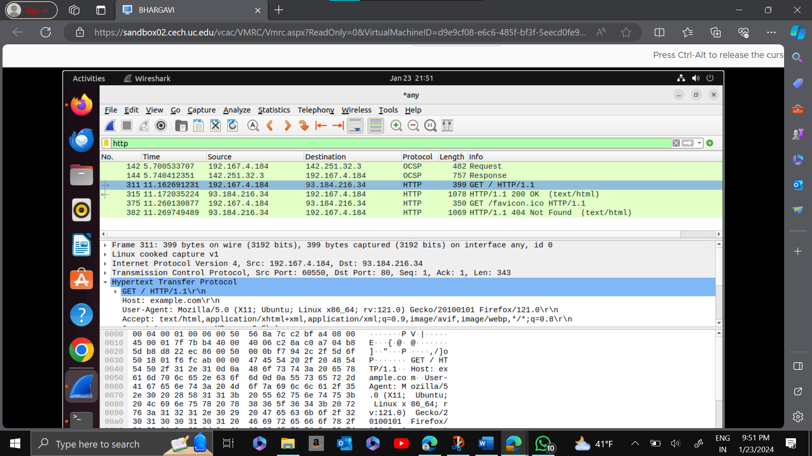
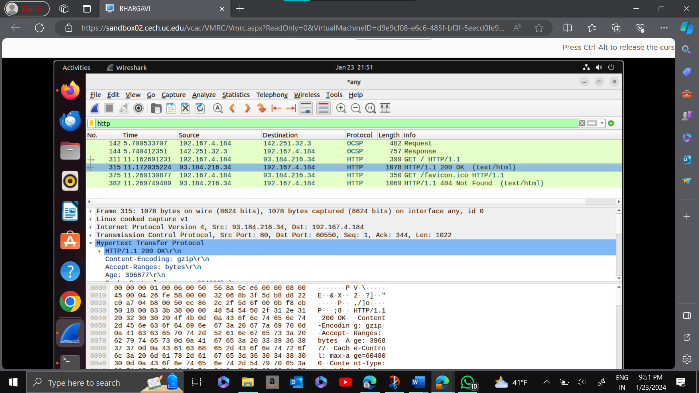
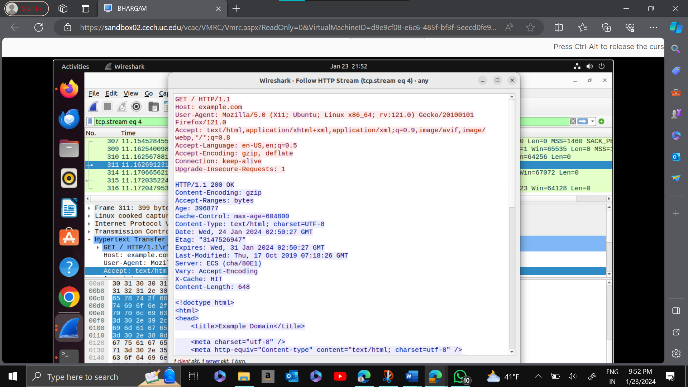
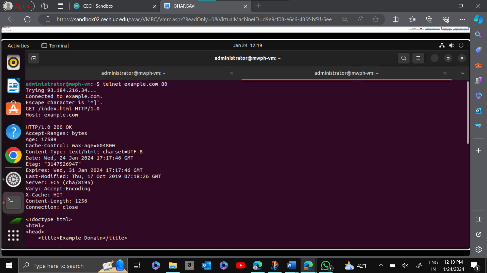
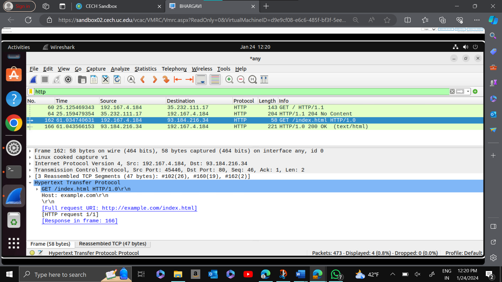
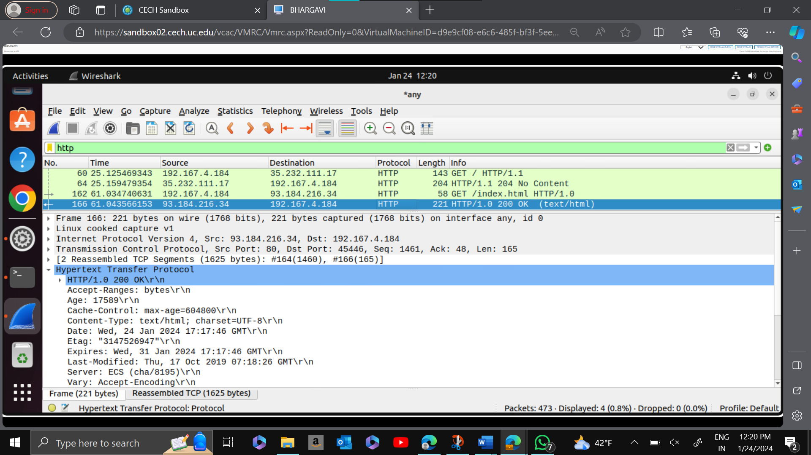

# WAPH-Web Application Programming and Hacking

## Instructor: Dr. Phu Phung

## Student

**Name**: Bhargavi Murari

**Email**: muraribi@mail.uc.edu

## Repository Information
Repository's URL: [https://github.com/BhargaviMurari22/waph-muraribi.git](https://github.com/BhargaviMurari22/waph-muraribi.git)
## Lab1's Report:
## Lab 1 - Foundations of the Web 
## The lab's overview and outcomes:

## Part I - The Web and HTTP Protocol
### Task 1. Familiar with the Wireshark tool and HTTP protocol

 I used Mozilla Firefox to search for "http://example.com" on a website and started Wireshark using the "any" option. Once the HTTP stream was accessible, Wireshark showed the HTTP requests and responses. Through the capture and presentation of the network traffic related to the web browsing activity, this made it possible to examine in detail the communication that took place between my machine and the web server.


HTTP Request

HTTP Response

HTTP Stream


### Task 2. Understanding HTTP using telnet and Wireshark

To use Telnet to perform HTTP tests, I entered "$telnet example.com 80" on my terminal. Following that, I typed the instructions' "GET /index.html HTTP/1.0" and "Host: example.com" commands. The HTTP request I had made and the response I received from the server were then shown by the command prompt, giving me a glimpse of the exchange that was taking place between the computer and the example.com web server.

  1. A screenshot of your terminal showing the HTTP Request and HTTP response from the server.

Terminal with Telnet

  2. REQUEST: The HTTP request sent in Wireshark Task 1 is similar to the snapshot that was taken using Telnet. Although Wireshark offers more detailed information, Telnet queries still include necessary components such as the host site, HTTP version, and "GET" method. Beyond the fundamental elements observed in Telnet, Wireshark's expert details include information regarding the "GET" request, severity levels, and arranged groupings.

Telnet Request

  3. RESPONSE: The host site's HTTP version and a successful "200 OK" status are displayed in the Telnet snapshot, which is a reflection of the HTTP response from Wireshark Task 1. Nevertheless, Wireshark goes above and above by offering a wealth of information, such as Response version, Status code, Response Phrase, content type, date of update, content length, and time and date of expiration. All in all, Wireshark provides a more thorough analysis of every answer line than Telnet does for the crucial information.


## Part II - Basic Web Application Programming

###   Task 1. CGI Web applications in C

   a. Rewritten:
I edited my C program in Sublime Text, compiled it with "gcc," and ran the executable on the web server using specific commands. The iterative process ensured code modifications were tested and deployed effectively.

   
   b. **(5 pts)** Summarize and demonstrate with a screenshot that you can write another C CGI program and deploy it with a simple HTML template provided on https://www.w3schools.com/html/ with proper title, heading, and paragraph, i.e., the course and your information should be there. Include the source code of the file in the report. An example of code inclusion is below.
   
   Included file `helloworld.c`:
   ```C
      #include <stdio.h>
      int main(void) {
        printf("Content-Type: text/plain; charset=utf-8\n\n");
        printf("Hello World CGI! From Phu Phung, WAPH\n\n");
        return 0;
      }
   ```

###  Task 2 (10 pts). A simple PHP Web Application with user input.

a. **(2.5 pts)** Summarize and demonstrate with a screenshot that you have successfully developed a simple `helloworld.php` PHP page with your name and PHP configuration as guided in Lecture 3. 

b. Demonstrate that you developed and deployed an echo Web application in PHP, e.g., `echo.php` with a screenshot with your name in the data **(2.5 pts)**. Include the source code of the file in the report and discuss if there are any security risks in this simple web application. **(5 pts)**

### Task 3 (10 pts). Understanding HTTP GET and POST requests.

a. Briefly describe how you used Wireshark to examine the HTTP GET Request and Response for the `echo.php` page with your name in the data. Demonstrate with two corresponding screenshots in Wireshark. **(2.5 pts)**

b. Summarize using `curl` to create an HTTP POST request with your name in the data. Demonstrate the outcome with a screenshot from the `curl` program **(2.5 pts)**, and a screenshot of the corresponding HTTP Stream in Wireshark. **(2.5 pts)**

c. Compare the similarity/difference between HTTP POST Request and HTTP GET Request and between the two HTTP Responses above. **(2.5 pts)**    

## Submission

Use the `pandoc` tool to generate the PDF report for submission from the `README.md` file, make sure that the report and contents are rendered properly.

The PDF file should be named `your-username-waph-lab1.pdf`, e.g., `phungph-waph-lab1.pdf` 
