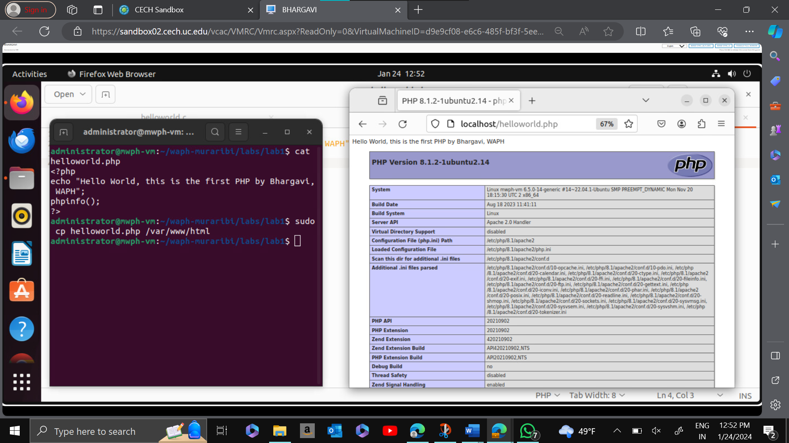

# WAPH-Web Application Programming and Hacking

## Instructor: Dr. Phu Phung

## Student

**Name**: Bhargavi Murari

**Email**: muraribi@mail.uc.edu


## Repository Information

Repository's URL: [https://github.com/BhargaviMurari22/waph-muraribi.git](https://github.com/BhargaviMurari22/waph-muraribi.git)

## Lab1's Report:

## The lab's overview and outcomes:

The lab is divided into two sections: web application programming and the Web and HTTP Protocol. In the Web and HTTP Protocol section, the Wireshark tool is used to investigate the synchronous aspect of the HTTP protocol. In this protocol, the browser sends HTTP queries to the server, and the server responds with HTTP requests.

Here is the direct clickable link to my GitHub lab folder: [https://github.com/BhargaviMurari22/waph-muraribi/edit/main/labs/lab1](https://github.com/BhargaviMurari22/waph-muraribi/edit/main/labs/lab1)

## Part I - The Web and HTTP Protocol

### Task 1:

 I used Mozilla Firefox to search for "http://example.com" on a website and started Wireshark using the "any" option. Once the HTTP stream was accessible, Wireshark showed the HTTP requests and responses. Through the capture and presentation of the network traffic related to the web browsing activity, this made it possible to examine in detail the communication that took place between my machine and the web server.


HTTP Request


HTTP Response


HTTP Stream


### Task 2:

To use Telnet to perform HTTP tests, I entered "$telnet example.com 80" on my terminal. Following that, I typed the instructions' "GET /index.html HTTP/1.0" and "Host: example.com" commands. The HTTP request I had made and the response I received from the server were then shown by the command prompt, giving me a glimpse of the exchange that was taking place between the computer and the example.com web server.

  1. A screenshot of your terminal showing the HTTP Request and HTTP response from the server.


Terminal with Telnet

  2. REQUEST: The HTTP request sent in Wireshark Task 1 is similar to the snapshot that was taken using Telnet. Although Wireshark offers more detailed information, Telnet queries still include necessary components such as the host site, HTTP version, and "GET" method. Beyond the fundamental elements observed in Telnet, Wireshark's expert details include information regarding the "GET" request, severity levels, and arranged groupings.


Telnet Request

  3. RESPONSE: The host site's HTTP version and a successful "200 OK" status are displayed in the Telnet snapshot, which is a reflection of the HTTP response from Wireshark Task 1. Nevertheless, Wireshark goes above and above by offering a wealth of information, such as Response version, Status code, Response Phrase, content type, date of update, content length, and time and date of expiration. All in all, Wireshark provides a more thorough analysis of every answer line than Telnet does for the crucial information.


## Part II - Basic Web Application Programming

###   Task 1: 

   a. I edited my C program in Sublime Text, compiled it with "gcc," and ran the executable on the web server using specific commands. The iterative process ensured code modifications were tested and deployed effectively.
 ```
   #include <stdio.h>
int main(void) {
printf("Content-Type: text/plain; charset=utf-8\n\n");
printf("Hello World CGI! From BHARGAVI, WAPH\n\n");
return 0;
}
```


   b. The "index.c" file's structure is shown in a screenshot, which also features a URL the professor gave.
   ```
   #include<stdio.h>
int main(void)
{
printf("Content-Type: text/html\n\n");
printf("<html><head><h1>Name: BHARGAVI MURARI</h1><h2>DEpartment: INFORMATION TECHNOLOGY</h2><p>This is web programming Hands-on lab</p></head></html>");
return 0;
}
```

   
 
 
###  Task 2: 

a. I created a "helloworld.php" file in Sublime Text, used the command "$ sudo cp helloworld.php /var/www/html" to move it to the web server, then used a browser to view it locally.
```
<?php
echo "Hello World, this is the first PHP by Bhargavi, WAPH";
phpinfo();
?>
```

  
 
 
b. I created a "echo.php" file in Sublime Text, used the command "$ sudo cp echo.php /var/www/html" to move it to the web server, then used a browser to view it locally.
```
<?php
echo $_REQUEST["data"];
?>
```
 


### Task 3:

a. Using Wireshark, I examined the POST and GET HTTP requests made by the "echo.php" application. I used Wireshark to record from any network before starting the server, and I took screenshots while examining and recording the requests and responses using the http filter.

 
Echo REQUEST Screenshot

 
Echo RESPONSE Screenshot


b. After using "sudo apt install curl" to install Curl on Ubuntu, I ran a command, as seen in the screenshot of the command prompt. I was able to view the HTTP request and response using Wireshark by right-clicking on the request and choosing the HTTP stream. Refer to the screenshot that is included.

 
Echo STREAM Screenshot

c. Similarities and Differences: 
Headers add extra information during the HTTP request and response cycle, including POST. POST is not visible in the address bar; GET is preferred for smaller data; and POST is used for data submission; GET is used for retrieval with parameters in the URL. These are the main distinctions.
