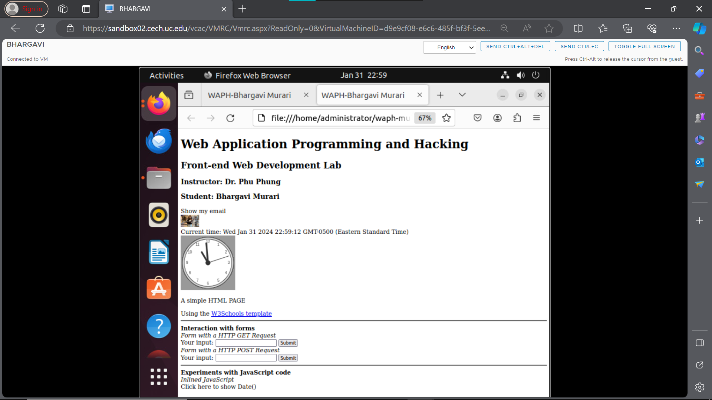
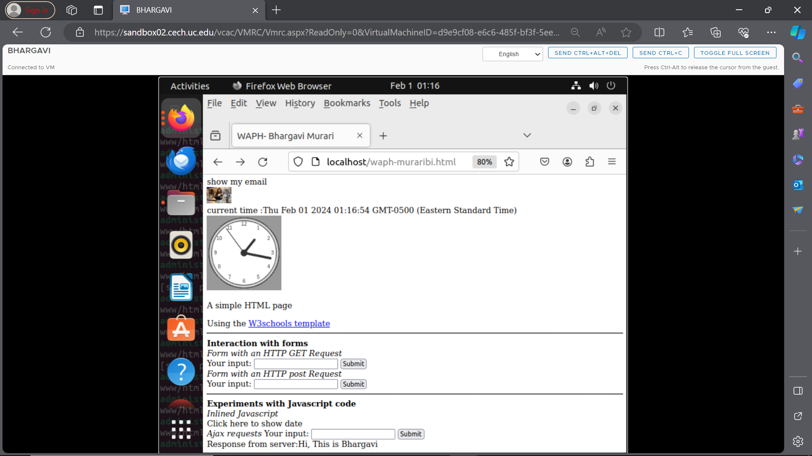

# WAPH-Web Application Programming and Hacking

## Instructor: Dr. Phu Phung

## Student

**Name**: Bhargavi Murari

**Email**: muraribi@mail.uc.edu


## Repository Information
Repository's URL: [https://github.com/BhargaviMurari22/waph-muraribi.git](https://github.com/BhargaviMurari22/waph-muraribi.git)
## Lab2's Report:
## Lab 2 - Front-end Web Development: 

## The lab's overview and outcomes:
The lab is divided into two sections: one covering forms in basic HTML and JavaScript, and the other covering AJAX, CSS, JQuery, and Web API connection. The first step entails building a simple HTML webpage with forms and sending data to an Echo.php file via the GET and POST methods in JavaScript. The form data is transmitted via AJAX and JQuery in the second section, and CSS is used to alter the HTML text both structurally and aesthetically. Using the attached GitHub link, access the lab materials: https://github.com/BhargaviMurari22/waph-muraribi/edit/main/labs/lab2/README.md

### Task 1. Basic HTML with forms, and JavaScript
# a. HTML
I created a simple HTML webpage called "waph-muraribi.html" using Sublime Editor. The website has forms made with image and input tags, as well as a headshot. I was able to view the webpage on Mozilla Firefox by going to "localhost/waph-muraribi.html" after hosting the HTML file on the server with the "$sudo cp waph-muraribi.html /var/www/html" command.
Following is the screenshot.


Waph-muraribi.html file opened in Mozilla Firefox after adding My Headshot using localhost/waph-muraribi.html


Waph-muraribi.html file opened in Mozilla Firefox after creating a form


This file was run since I utilized the Action method, made a GET request in the form, and set it to echo.php. html code for that can be found here:
 ```
    <b> Interaction with forms</b>
         <div>
             <i>Form with an HTTP GET Request</i>
             <form action="Echo.php" method="GET">
                 Your input: <input name="data">
                 <input type="submit" value="Submit">
              </form>
         </div>
```
This is the final result that the user's browser shows once they click the submit button.
 
 

 I added a new form for POST, which is shown in this screenshot. 

  

Similarly, here is a quick description of what caused a POST request to be made:

  

  b. Simple JavaScript
 I included inline JavaScript code into HTML elements to display the time and date as of right now. An example of how the inline script works is shown in a browser screenshot.

 

 A key push causes the digital clock to refresh. Here, I held down a key for a while before pressing it. The updated time is displayed in the given snapshot by means of a script tag.


I used Sublime Editor to create a "email.js" file that contained my email embedded in an HTML file. A script element was then used to link the "email.js" file to the HTML file. I added a div tag with the content "<div id="email" onclick="showhideEmail()">show my email</div>} inside the HTML body element. As specified in the "email.js" file, the goal is to show or hide the email when the div is clicked.

```
var shown = false;
function showhideEmail(){
   if (shown) {
     document.getElementById('email').innerHTML="show my email";
     shown = false;
   }
   else {
     var myemail= "<a href='mailto:kamatikn"+"@"+"mail.uc.edu'>kamatikn"+ "@"+"mail.uc.edu</a>"
   document.getElementById('email').innerHTML=myemail;
   shown = true;
   }
 }
```
 The screenshot of the browser that shows the email hidden behind is below:

 

  Here is an email screenshot that we can see by clicking on it:

  

With the help of an external JavaScript code and the script tag, I have created an analog clock.
The supplied library is shown below.

```
<script src="https://waph-uc.github.io/clock.js"></script>
```

Furthermore, below my photo, I've printed the analog clock. That code is as follows:

```
<canvas id="analog-clock" width="150" height="150" style="background-color:#999"></canvas>
```

The automatically updating analog clock snapshot is shown below:



### Task 2. Ajax, CSS, jQuery, and Web API integration
a. Ajax:
 To collect user input and send it to "echo.php," I used Ajax (asynchronous JavaScript and XML), and I used XMLHttpRequest() to get the server response. The getEcho() function contains JavaScript code that, when a button is clicked, records user input. It makes an Ajax GET request to the "echo.php" web application, displaying the content of the response inside a designated div element.
 
 ```
function getEcho() {
 var input= document.getElementById("data").value;
 if(input.length==0){
 return;
 }
 var xhttp= new XMLHttpRequest();
 xhttp.onreadystatechange=function(){
 if(this.readyState==4 && this.status==200){
 console.log("Received data="+ xhttp.responseText);
 document.getElementById("response").innerText="Response from server:"
 + xhttp.responseText;
 }
 }
 xhttp.open("GET", "Echo.php?data="+input,true);
 xhttp.send();
 document.getElementById("data").value="";
 8
}
```

Here are two screenshots of the Ajax answer in the console and web browser.




Ajax requests are made to the server-side script "Echo.php" via the JavaScript function getEcho in response to user input. An XMLHttpRequest object is created for an asynchronous GET request to the server after it gathers user input from an HTML input element and validates it. The information received from the server is shown by the callback function through the recording of data to the console and the update of an HTML element's content with the id "response" to reflect the responses. This is an example of a standard Ajax flow, where user actions dynamically update webpage content without requiring a full page reload. After that, the input field gets cleared.


 b. CSS
 An HTML webpage's styling can be improved by using CSS (Cascading Style Sheets). I colored the buttons on the website by using the style tag. This is the tag I used for this styling, which is below.

 ```
<style>
 .button {
 background-color: #4CAF50; /* Green */
 border: none;
 color: white;
 padding: 5px;
 text-align: center;
 text-decoration: none;
 display: inline-block;
 font-size: 12px;
 margin: 4px 2px;
 cursor: pointer;
 }
 .round {border-radius: 8px;}
 #response {background-color: #ff9800;} /* Orange */
 </style>
```
 To completely alter the webpage's structure, I have additionally used link tags. That is,

 ```
 <link rel="stylesheet"
 href=https://waph-uc.github.io/style1.css>
```
 The screenshot of the webpage browser with the Cascading style added is shown below.

 

 

 c. The jQuery
 I utilized the CDN to use the JQuery library, so

 ```
 <script src="https://code.jquery.com/jquery-3.7.1.min.js"
 integrity="sha256-/JqT3SQfawRcv/BIHPThkBvs0OEvtFFmqPF/lYI/Cxo="
 crossorigin="anonymous"></script>
 ```

 Using input tags, I created two buttons. To build routines that would activate when the buttons were clicked, I used JQuery. The buttons' HTML code can be found below.
 
 ```
 <input class="button round" type="button" value="jQuery Ajax GET Echo" onclick="jQueryAjax()"
 <input class="button round" type="button" value="jQuery Ajax POST Echo" onclick="jQueryAjaxPost()"
```

 i. Using an Ajax GET request, the JQueryAjax() method gathers user input and sends it to "echo.php." Additionally, the code uses JQuery to print the server answer. This is a sample of code that implements this capability.

```
 function jQueryAjax() {
 var input = $("#data").val();
 if (input.length == 0) return;
 $.get("Echo.php?data="+input,
 function(result) {
 $("#response").html("Response from server:" + result);
 }
 );
 $("#data").val("");
 }
```
This is a screenshot of the network properties following the click of the Ajax Get echo button.


 ii. Posting Ajax Requests To complete the identical task as above, I used the JQueryAjaxPOST() method. and for that, the code is as follows:

 ```
 function jQueryAjaxPost() {
 var input = $("#data").val();
 if (input.length == 0) return;
 $.post("Echo.php",{data: input},
 function( result ) {
 $("#response").html("Response from server:" + result);
 }
 );
 $("#data").val("");
 }
```
The browser and console are shown in this screenshot of the Jquery post.

 

 Using the POST method guarantees that the requested data is not visible in the URL, in contrast to the GET method which exposes data in the URL. The POST method is typically chosen over GET because of its increased security.

 

 d. Web API integration
 i. To send a request to the "https://v2.jokeapi.dev/joke/Programming?type=single" API, I used JQuery Ajax. The humorous portion of the API response will be extracted and shown by the JavaScript code. The snippet of code for this capability is shown below.

 ```
$.get("https://v2.jokeapi.dev/joke/Programming?type=single",function(result){
 console.log("from jokeapi:" + JSON.stringify(result));
 $("#response").html("Programming joke of day" + result.joke);
 })
```
This is a screenshot of the console output that I took after looking at the code:

 

  ii. I used the "https://api.agify.io/?name=input" retrieve API to display the age at random. After a user inputs their name and clicks the HTML "Guess Age" button, the age data is retrieved and displayed using the get API.

 ```
 <input class="button round" type="button" value="Guess age"
 onclick="guessAge($('#data').val())">
```
 When the Guessage() function is invoked, it appears as follows:
  
 ```
async function guessAge(name){
 const response =await fetch("https://api.agify.io/?name="+name);
 const result=await response.json();
 $("#response").html("Hi"+name + ",your age should be "+ result.age);
 }
```
This is an image of the output when the age data is shown:

 

